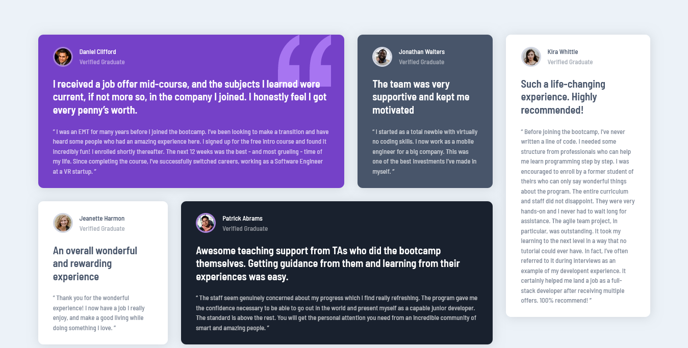

# Frontend Mentor - Testimonials grid section solution

This is a solution to the [Testimonials grid section challenge on Frontend Mentor](https://www.frontendmentor.io/challenges/testimonials-grid-section-Nnw6J7Un7). Frontend Mentor challenges help you improve your coding skills by building realistic projects. 

## Table of contents

- [Overview](#overview)
  - [The challenge](#the-challenge)
  - [Screenshot](#screenshot)
  - [Links](#links)
- [My process](#my-process)
  - [Built with](#built-with)
  - [What I learned](#what-i-learned)
  - [Continued development](#continued-development)
- [Author](#author)
- [Acknowledgments](#acknowledgments)

## Overview

### The challenge

Users should be able to:

- View the optimal layout for the site depending on their device's screen size

### Screenshot

### Links

- Solution URL: [Solution]()
- Live Site URL: [Site](https://juanmartinrivas.github.io/testimonials-grid-section-main/)

## My process

### Built with

- Semantic HTML5 markup
- CSS custom properties
- Sass
- Flexbox
- Mobile-first workflow
- Parcel 

### What I learned

This project was really good to practice my flexbox skills and to polish my ability to build responsive layouts.

### Continued development

I'm  willing to listen to any feedback made by the community. I plan to correct any mistakes I could have made.

## Author

- Frontend Mentor - [@JuanMartinRivas](https://www.frontendmentor.io/profile/JuanMartinRivas)
- Twitter - [@RivasJuanman](https://twitter.com/RivasJuanman)
- Linkedin - [Juan Martín Rivas](https://www.linkedin.com/in/juan-mart%C3%ADn-rivas-b3253a1a8/)
- Github - [JuanMartubRuvas](https://github.com/JuanMartinRivas)

## Acknowledgments

Thanks to anyone who gives me feedback on this project and helps me improve